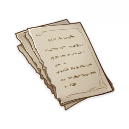
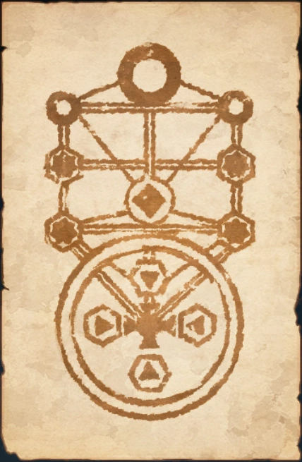

# Book of Revealing

!!! note
    The content on the pages still consists of incomprehensible symbols, letters, ancient languages, and geometric figures. But a period of focus seems to gradually render their meaning comprehensible.
  
## Enigmatic Page (I)  
  
...read countless volumes here. It appears that these books were left behind by an ancient order... Kingdoms rise and fall, and when a civilization is annihilated, a new one will be born after from the ashes, which these books refer to as "Fortuna"... It's somewhat rudimentary, but theoretically at least, it bears striking resemblance to the computational scheme I have formulated and termed "world-formula"...  
...All the records are blurred with age. But were I able to quantify them to some extent, they could be of use in my "world-formula" calculations...  
  
...No matter how many times I derive it, the result remains the same, though this result is not expected... Unlike the world depicted in these ancient texts, there will be no more new civilizations born... Unless we consider introducing "variables" from outside the system... If it was that sort of power, there might be a chance...  
  
{width=350}
  
Here I found the magical techniques left behind by the Golden Troupe (they seem to be referred to by various names, I'll go with this one for now). Based on my interpretation, it appears to be known as the "Seal of Chymical Marriage" and consists of two parts. However, it has been weathered too much to decipher any more information... Interestingly, I have encountered similar symbols in documents from the Narzissenkreuz Institute archives... They look complicated, yet the underlying principles are quite clear. If the records prove accurate, there are some key locations within the realm remaining... Related records may be found elsewhere as well... I should record my findings here for now, as they may prove useful in the future...  
  
## Enigmatic Page (II)  
  
...The pollution of the land and water wrought by the giant beast Elynas seems to have been mostly purified and diluted. However, when it comes to Elynas itself, even the adults seem to be at a total loss. They simply cordoned off the surrounding area. Nevertheless, it was quite easy to sneak in. It felt rather strange slipping into the creature's mouth, and it reminded me of events from some of the stories I once read...  
  
...Though I have no substantive evidence, I still sensed some sort of "will" from it. Jakob did, too... There were no signs of decay in the flesh. Instead, its body was hardening, as if forming a protective membrane. Given its current immobilized state, it looked like a self-defense mechanism to safeguard its internal organs...  
...But it does make sense, with such a wellspring of vitality... If my deduction is correct, it may also be used to enhance Jakob's strength by following the same principle... However, at this stage, there's no need to subject Jakob to such risks. I should get safe experimental data first through the Institute of Natural Philosophy, and then set specific research objectives. Although, as Jakob mentioned, this may waste a lot of precious time...  
...After all, the flesh of Elynas remains toxic, and the risk if Jakob...  
  
...Jakob has returned. He's quite brave, but also an idiot. He didn't give any thought to the possible consequences. We have no one else to rely on now. If he...  
...The data we've collected is still incomplete. Jakob had minor adverse reactions, primarily vomiting. But he recovered quickly and hasn't shown other symptoms in the short term. His mental status and physical status remain stable... It's only possible because Jakob completely trusts me... Our lives are limited. Still, even if it's just for the future, we must find a way to get allies, get stronger, and prevent disaster...  
  
...Alain has enrolled in the Institute of Natural Philosophy. He should fit right in with his sharp mind. I brought the pocket watch he gave us, and we compared the time only to find there was already a significant discrepancy... We agreed to meet at the Institute. The brightest minds of Fontaine are gathered there, and we can expect to make huge progress and get much-needed help...  
...As for Mary-Ann, just the sight of her fills me with joy. We had a long discussion about the Narzissenkreuz Institute, but Jakob was crying through most of it... I didn't tell them about Jakob. It's because Uncle Guillotin, who was with them, is part of the Maison Gardiennage. Although he seems to be treating Alain and Mary-Ann very well, he still can't be trusted. After all, Father and Mother... It was all the doing of their lackeys and goons...  
  
## Enigmatic Page (III)  
  
...The tests on Jakob's strength continue. As before, the flesh and blood of the great beast Elynas is being used as nutrition. Jakob seems to have gotten used to it, so there's nothing to worry about anymore. Thus the "adverse reactions" observed before may just have been caused by Jakob's feelings of disgust. It's a relief to know that his physical condition hasn't been harmed...  
...Jakob still eats, but only out of habit and no longer as a necessity for survival. But I suppose it's a good thing, because eating together is nice. It suddenly occurred to me that jam was somewhat similar to the flesh and blood of Elynas, so I made a joke about it. Jakob seemed quite uncomfortable...  
...The results have improved significantly in comparison to previous tests. Perhaps more can be done... Then the next step would be to attempt the opening of a "passage"...  
  
...The "passage" was opened successfully, though it only lasted a short while. During this time, many black monsters that were shaped like dogs emerged. They were very aggressive and terrifying, but thank goodness Jakob was here. Though he was so scared he was crying, he still managed to wipe them out while bawling...  
...These monsters are identical to those we discovered during our desert expedition. However, those were salt gray, stiff, and immobile at the time, so it was relatively safe...  
...I'm certain their properties are nearly identical to those of Elynas...  
  
...The Khaenri'ahn records mention "passages" appearing in large numbers, and numerous dangerous monsters that looked like dogs emerging from them. It's very likely that they are the same type...  
...It can be safely postulated that the location these "passages" link to is full of these monsters, and I shall tentatively call them "Beastly Rifts"... thus, these hounds may be called "Rifthounds"...  
  
## Enigmatic Page (IV)  
  
...I've been assigned to Alain's lab... That guy only likes things he can figure out completely. If this were a novel, he might be the type of villain who becomes a crazed serial killer just to figure out how the human body works. But he doesn't seem even remotely phased about such statements. On the contrary, he spoke to us about the similarities and differences between humans and machines, and between artificial intelligence and personality. Uh-oh, this is bad, at this rate he might really turn into a villain like that...  
  
...I was disappointed to discover that quality of the people from the Institute is worse than I expected. I expected the people here to be smarter and more open to new ideas than those in high positions outside, but the reality has been infuriating. Or perhaps it would be more appropriate to call it incomprehensible. It stands to reason that a research institution with such vast resources should possess the greatest talent... Alain's assistant isn't very good, a little stupid even. But at the very least, he is not hostile and doesn't fear us...  
  
...I'm unable to get the research resources I desire for now. But that isn't a bad thing. Jakob has always been fond of watching him take apart pocket watches and other clockwork devices... The direction of Alain's research on controlled annihilation isn't bad, and it would be very interesting to figure out the nature of ousia and pneuma. After all, as a form of energy localized to Fontaine that has been observed in living organisms, fully researching them might help us understand the difference in nature between the structure of our bodies and that of Karl's...  
  
...In any case, I must find a way to win over the people here. Though their imagination is limited, and it's unpleasant to say so, they have some influence outside the Institute. Their strength and resources must be consolidated to help them... I can use that book to show them what we've experienced...  
  
...Although they say a single piece of evidence is never sufficient, the change in Jakob fills me with hope. If I can make more people accept this kind of change, then it wouldn't matter even if we came face to face with the apocalypse. Even if our world couldn't even grow mint, we could still survive, and as long as we can survive, we can revive our civilization. That will be the next topic...  
  
...He called it a field investigation from the higher-ups, but I think Carter just wanted to take us out to have some fun! I wonder when he got to know Mary-Ann... Though it's quite nice because I haven't seen such a carefree smile on her face for a long time. The same goes for Jakob and Alain, it's like they were back in the Narzissenkreuz Institute... Of course, I was quite happy too. Based on the ruins here, it's likely to be related to the "Golden Troupe"... If that is true, the huge stone figures in the ruins may have significant research value as well... I found a damaged map, it may be useful...  
  
...I just found out about his physical condition. It seems I cannot continue indulging in mechanical research with Alain, and I must find a final solution as soon as possible. Or it will be too late...  
  
## Enigmatic Page (V)  
  
...Alain made a huge breakthrough. Everyone is discussing Fontaine's energy revolution. But instead of praise, there seems to be more jealousy drifting around the Institute. Although it has nothing to do with me, I'm still furious on his behalf...  
  
...The adventurer we commissioned found something really valuable, a red gemstone that appeared on the snowy mountains of Mondstadt after the disaster. Its properties are very similar to the flesh and blood of Elynas (verified by Jakob). It's supposedly a product of the great dragon's decaying corpse (in order to reduce confusion, it will hereinafter be referred to as Scarlet Quartz)... Although it generates heat and has the effect of increasing explosive power, the toxins it contains mean ordinary humans cannot withstand it, with the exception of ①Neohumans (tentative name) like Jakob ②capable of detoxifying it (none have been found yet)... Another similar discovery is the filth in the great mines of Liyue...  
  
...Unfortunately, I've hit a snag in my research. The biggest challenge is how to reproduce results... But if I can obtain sufficient resources, I'm certain I can overcome this... At the very least, the idiots on our side still admire (fear) us. The tricks I put Jakob up to were very quite effective... Even though it's quite sad that people from an Institute of Natural Philosophy have somewhat turned into believers, at least I can entrust them with simple tasks... Let's use that name to form a "society" for now. I'll use it as a means to give them organization and a sense of belonging...  
  
...But Carter is unconscious. I took samples of his blood and skin and got a swift catspaw to take it to Sumeru to be looked at... other from observing the problem, the root of the problem cannot be found. It's pointless, absolutely pointless. Conventional medicine is pointless. I must figure something else out...  
  
...Jakob... Jakob's proposal is very dangerous. I must give it more thought.  
  
...  
  
...I told Carter everything and had Jakob prove his strength and transformation. I even explained the risks, its historical baggage, and my other objective: To create a second sample that can corroborate the realization of human transcendence via ██, and derive the holistic character and method from it. Carter isn't very good at thinking scientifically, so I used many examples and methods of emphasis. But he seems to have made up his mind from the beginning.  
  
...  
  
...Still deteriorating.  
...It seems Jakob's successful integration was an extreme case. Or perhaps he's not himself anymore? I can't be sure.  
  
...  
...I must continue observing. It can't be a waste. It can't be a waste. Or else it will all have been for nothing, utterly meaningless. I got more materials in an attempt to reverse it. All sorts of relics and biological tissue from after the calamity. I even got my hands on extremely dangerous residue. Nothing worked. But I can't give up. He's still "alive" right now. At the very least, in this sense, it can continue. It cannot be a waste.  
  
...  
...He's preserved for now and further tissue collapse has been prevented. Jakob doesn't tear up at the sight of him anymore... but occasionally Carter's voice is occasionally heard from... and that's the worst. I've tried cutting out the organs where his vocal cords probably are, but they grow back in one to three days...  
  
...  
...Alain and I have completely broken off our working relationship. It's regrettable, but I don't blame him... The most regrettable part is the previous direction was proved to be ineffective, but it wasn't all for naught. Identifying the errors made was the greatest benefit. Due to the short lifespans, the cost of trial and error is very high. On this account, I must thank Carter. So, I must find a way to save him. I must prove that I can do it... Another thing I gained is members of the society have grown more loyal. Aren't I a talented actor?  
  
...  
...During my discussion with Jakob, I thought of another direction that's worth trying. It may be the solution to everything...  
  
[Most of the remaining content cannot be deciphered due to the thoughts expressed being utterly incoherent.]  
  
## Enigmatic Page (VI)  
  
...In the expedition to Petrichor and the ruins from before... we discovered... origin. It seems that compared to humans, we...  
If... all return to... transcend. Although anti-intellectual and counter-intuitive,... the ancients succeeded before...  
  
[Most of the remaining content cannot be deciphered due to the thoughts expressed being utterly incoherent.]  
  
## Enigmatic Page (VII)  
  
...It's really nice to see her again. But there's nothing here except water, which is really quite uncomfortable. Actually, I felt the same way when I traveled to Sumeru with Jakob and Karl. Empty buildings feel lonely, yet enduring at the same time... In the apocalypse, stone structures outlive humans a million times over. It's the same here. So, to a certain extent, it's just a bit of apocalyptic scenery... The director has been observing these scenes for so long, so I'm sure she feels much of the same sorrow. I should visit her when I have the time... Build a new home and bring her over? Jakob would be happy too.  
  
...Jakob left behind the feather ornament given to him by the vice director, the same ornament he'd been keeping carefully... As a result, we never used it as a wand to play any games...  
...I discovered that this place was very likely an ancient... facility. If so, I should be able to find useful data... The script's content...  
  
...I'll visit the director again next time. I heard Mary-Ann will be coming to see her too. It would be nice if we could meet. After all, right now Alain is...  
  
## Enigmatic Page (VIII)  
  
...Rather than calling it a sword, it should be called a key... It does not belong to anyone, and it just travels from one hand to the next... The wills of countless people be concentrated... Necessary materials and rituals...  
  
...  
  
...It's actually quite interesting, it basically just boils down to a kind of extremely effective witchcraft that takes advantage of the situation. But the reason it is effective is due to the nature of the origin, the primordial... based on the records, the constituent elements should be a "Circle of Four Orthants" and a "Tree of Emanation"... flows from the roots toward the center of the circle, and the circle encircles the abstract of... It's akin to pie crust and the filling of the pie, a metaphor sure to excite Jakob. Hmm, we'll need some suitably sophisticated terminology for the laymen...  
  
...Found the ancient seal's general location. If the records are accurate, we should be able to confirm the specific site... We should also be able to determine the locations of the four constituent elements, for as long as we find one, we can calculate all other nodes... We arranged for members of the society to visit several candidate locations, we should be able to find traces of water and channels of higher quality and density...  
...This is just hilarious now. The secrets that ancient civilizations, so carefully guarded, what a joke... Turns out we've already been through the same countless times in our youth...  
  
...The slate replica we discovered supported the calculations. As the prelude to the apocalypse, the sea will...  
  
As for rumors about us and opposition to the society...  
  
[Most of the remaining content cannot be deciphered due to the thoughts expressed being utterly incoherent.]  
  
## Enigmatic Page (IX)  
  
...Finally convinced her to follow us to the gestalt still under construction... She seemed apprehensive, but everything will turn out fine. We no longer have to fear the future. I have a lot of power at my disposal now: I have Jakob, the members of the society, and I generally know what to do... agreed at last. Now we can obtain the most precious... After all, other than the inferior mutants, you can no longer see the original in Fontaine...  
...I am very satisfied with Jakob's design. The sense of mystery and ceremony is very intense. He may have a real knack for this...  
  
...  
  
...The rebuilding of the Four Orthants is near completion, and we have positioned our people based on the locations on the map... Reversing it and adding the power of the sword should be sufficient to control...  
...All of us Fontainians will be able to transcend in this way, shedding the limitations of physical form and separation, and prevent the apocalypse...  
  
...Got the sword, despite the cost... The director's condition is deteriorating. Hope she can hold on...  
  
...  
  
...Leaving the pocket watch here, for the time for farewell has come. I'll be the first subject to part, so useless personality can be removed... To process Carter for rebirth. I failed him... Alain will be impressed with me. Mary-Ann will be delighted. Same with Jakob, since that fellow is like a brother to him... Yeah, everything will get better. So, Jakob, I hope you stop making that face.  
...Farewell, I shall rediscover myself through water, and be reborn through water. This is a tremendous feat that no one else in natural philosophy has ever attempted. If it fails, I won't have to worry about the future anymore.  
  
## Enigmatic Page (X)  
  
Everything has become consummately clear. All meaningless obstacles have vanished. This trial was a great success. I know now what I must do. This process appears to have cost me some time and experience. But that won't matter. I shall have all the time in the universe, after all.  
I am become Narzissenkreuz.  
  
...  
  
The memories do not seem to match the records. Perhaps...  
  
(Most of the content has dissolved completely before it could be comprehended.)  
  
## Enigmatic Page (XI)  
  
...Shall be the passage between the primordial and the present...  
...Deconstruct and reverse its utility, and internalize...  
...Use to fully master...  
  
...Matrimony of chemistry, bonding of the elements...  
...Circular ruins, forest in the mirror...  
  
...Send Lyris and Jakob to...  
  
(Most of the content has dissolved, and is beyond comprehension.)  
  
## Enigmatic Page (XII)  
  
...Three agents have been absorbed to date. Useful skills gained...  
...Discovered from their memories that, regarding the Ordo's existence, the Court of Fontaine has officially...  
  
...  
  
...Very interesting mechanism. With the right organ, consciousness can be transplanted...  
...Has the knowledge to operate the mechanism. Understand the general idea after absorption that other than an experimental model, all operated on a simple logic tree...  
...An interesting attempt, but the path he chose was regrettable. Rene would definitely think so...  
...Jakob got emotional because he does not wish to oppose the Guillotin siblings...  
  
...Declined, of course. Alain Guillotin said before leaving that "it seems that there's no going back." Alas, he is only a genius when it comes to machines. In all other things, he is but ordinary. He does not understand the future — he does not even realize that we hit the point of no return long ago. I, however, will create the future, and there will be a place for him and Mary-Ann Guillotin in it.  
  
(Most of the content has dissolved, and is beyond comprehension.)  
  
## Enigmatic Page (XIII)  
  
...Go to Elynas and carry out the above order together. Buy time.  
  
Let us meet again in the new universe and the pure sea of tranquility.