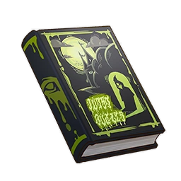

# The Fall of the Faded Castle

  
## Vol. 1

!!! note
    A poem penned by an author unknown. The writing style seems to give off a strange and ominous aura.
  
Once, in a dream, I saw a black ship.  
It sailed through dark night and bleak fog.  
The hull was rotten, the mast shattered,  
Yet in some perverse jest at human rationality,  
Each broken piece had been placed in some twisted way,  
Entwined together by the algae and seaweed that enveloped the vessel,  
Forming a dreadful dark shadow that shambled through the moonlight,  
That none could glimpse and not panic.  
Shift your gaze just a little, and in an instant,  
It shall appear again before you.  
A tall and slim figure standing upon the deck,  
Wrapped in dark robes, its face barely seen.  
Only its eyes, those two cold eyes,  
Which can pierce your soul with a glance.  
Was that a monster that arose from the depths of the seas?  
A lord returned from some ancient world?  
Or perhaps the nightmare itself?  
  
## Vol. 2

!!! note
    A poem penned by an author unknown. The writing style seems to give off a strange and ominous aura.
  
By the banks of the world's purest lake,  
There once stood a glistening castle.  
Gold leaf and gems decorated its walls,  
And it shone blinding in the post-noon sun.  
Pretty banners and flags flew from the roof,  
While majestic towers soared alongside.  
Guests from afar peered through colorful windows,  
And marveled at the wonders every step revealed.  
Yet none was more marvelous than the many statues,  
Odd in form but as real as life.  
In the center of the hall sat a golden stage,  
Where musicians played day and night for the castle's master.  
As the music sounded, listeners flocked like swarming bees,  
To dance in time with the beat that seemed to captivate the entire world.  
The wine flowed never-ending to sate the thirst for revelry.  
All could partake, no matter their class or their homeland,  
But none of this could ease the master's fears,  
Or bring his troubled soul a moment of peace.  
And each time the tower's clock struck its deep midnight chime,  
He would be possessed by an uncontrollable panic,  
Trapped by his fears and his gloom.  
The dark-robed figure would surely collect on debts owed,  
And all before his eyes would be turned into dust,  
The souls of his guests, and his own, included,  
As tribute to that dark, ancient world.  
  
## Vol. 3

!!! note
    A poem penned by an author unknown. The writing style seems to give off a strange and ominous aura.
  
At first, all was still, apart from the curtains in the breeze,  
And the faint sounds of animals chewing, echoing through the walls from some unknown place.  
Then, an odd rasping laugh erupted from an empty room,  
A nameless horror spreading in the dark.  
Then, with terrible thunder and storm,  
A glowing red fog-cloud,  
Embraced the castle just like a shroud.  
On the castle's great central stage, a tall thin figure did appear,  
A dark spirit in black robes, arriving at last.  
The guests, a moment ago enjoying their revels,  
Fell to the floor one by one,  
Bereft of time even to scream.  
The master sat shivering and still on his throne,  
His soul also snatched by the dark.  
Amid the roar of brick and tile hitting the ground,  
The castle's glory faded into the past,  
Swallowed by glimmering waves.  
The blood moon the towers once blocked reappeared in the sky,  
Its baleful glow sweeping the land.  
And today, by the banks of the world's purest lake,  
The water reflects the long-fallen, faded castle.  
The joy and brilliance that once lit its halls,  
Consigned to legends and dreams.  
The ruins lie suffocated in the gloom.  
Through shattered windows, statues appear as like to monsters,  
Who with the discordant tune that played sank with the castle into the sea.  
There is nothing there now, bar darkness, death, and loss.