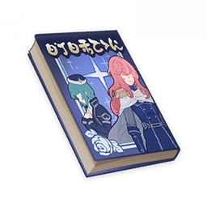

# A Legend of Sword

Author: &nbsp; &nbsp; &nbsp;**Zhenyu** (pen name of **Xingqiu**)  
Illustrator: **Calx** (pen name of **Albedo**)
  
## Vol. 1

!!! note
    Amid a sea of stars that spin in reverse, light-centuries of war unfold down on the planet's surface... With this grandiose opening comes an all-new tale of gallantry!
  
"Even if Emperor Sher's ambitions are realized, how will anybody benefit from it?"  
Secretary of Defense Faranges stared out of the window into space as the galaxies and stars shone gently upon her face, their pale white glow flowing softly and slowly down each strand of her hair.  
She couldn't help but think back to the first time she looked out at this ocean of stars through this very window. But she no longer remembered the sense of awe she felt back then. Even her homeland, now hundreds of light-years away, had long since become faded and distorted in her memories whenever they surfaced in her dreams.  
"Forgive me for speaking out of place, Your Highness, but this war has been dragging on for far too long. We've battled through countless constellations, wiped out tens of millions of lives in all sorts of devious ways, and made ourselves viceroys and envoys of every obscure constellation we came across, all in an effort to make Emperor Sher's dreams a reality. But what has His grand vision brought us? One misfortune after another, and an ever-growing number of enemies. They're in every corner of the galaxy now... it's just a matter of time before they swallow us up!"  
"My brother's vision is for an empire that will rule for all eternity, one where there is no fear, and where people do not lack for anything. The fate of the many will no longer be dictated by the few, no one will enjoy a higher status than anybody else, and even incompetence will no longer be seen as a crime. And so... it is inevitable that those who cannot comprehend this grand vision are doomed to be swept aside. This is their fate."  
Princess Gopatha shook her head and spoke with a gentle yet cold tone.  
It seemed as if the Intergalactic Anti-Guerrilla War had robbed her of more than just one of her eyes and one of her arms, because when Faranges looked at her, she did not see the joyful young woman she once knew.  
"I trust in brother's decision — he would not act out of mere self-interest. So please, even though it is you, don't say such things again in the future. Don't speak words that sow doubt."  
  
## Vol. 2

!!! note
    Amid a sea of stars that spin in reverse, no battle is legendary enough to be any more than a ripple in the silence for those who dwell upon the shore... But for the warriors in the thick of it, the war is all there is.
  
Surely, even an armada consisting entirely of Yazata-class warships would have a tough job making a dent in a defense as watertight as this one.  
Admiral Geldafried's overconfidence in the greatest technological marvel of the empire meant that she was completely unaware that the rebels were, at that very moment, closing in on the fatal weakness of their base. The mighty Star Fortress, Anusharwan — designed personally by Princess Gopatha, and named by Emperor Sher — was now nothing more than a fragile egg before the rebel fleet, and mother hen was away from the nest.  
Bastinu deftly navigated the Lachsz Clipper through the intricate and winding ventilation system, weaving between jets of poisonous gas and elemental clouds shooting out from holes in the walls, while trying to shake the automatic mechanical sentries on his tail. His eyes and ears filled with blood and the scene before him merged into a continuous blur of color and light as the clipper shot ahead at a breathtaking speed.  
"Now's my chance."  
So thought Bastinu to himself as the propulsion system's energy core came gradually into view.  
"It's time."  
So thought Admiral Geldafried to herself as she gazed at the flashing sphere of light in the planet's orbit.  
Then, she gave the order to launch an indiscriminate assault on the planet.  
Then, Bastinu launched a fatal attack on the fortress core.  
  
"Oh, what I would give to see the look on Princess Gopatha's face right now..."  
So thought both to themselves, separately but identically, in that brief moment.  
  
## Vol. 3

!!! note
    Amid a sea of stars that spin in reverse lies a small chain of shattered isles, each of which has its own history, featuring tales heroic and trivial alike. This heroic tale is set in the time of the Suruga Shogunate.
  
Ten years earlier...  
25 light years away...  
  
With the nation under the rule of the Suruga Shogunate, cries of anguish filled the streets as the people suffered bitterly.  
At that time, the Suruga Shogunate was led by the Seii Tai-Shogun, Imagawa Ujizane. Four years prior, after finally beheading Demon King Danjouchuu, the Tai-Shogun's own reign of terror began.  
It was in this time and place that our free and unrestrained swordmaster wandered the land.  
His name was Bitchuu Kyuubei, and he was known to the people as Shinkurou, the vigilante.  
Bitchuu Kyuubei was not a ronin as such. It is said that he was once the most trusted strategist for His Excellency the Tai-Shogun, until one day he was framed by a rival. Given the Shogun's paranoid nature, this left him with no choice but to flee the Shogunate and escape into the wilderness.  
  
Today, Shinkurou was standing on a mountainside gazing into the distance. But what was the object of his gaze?  
Was it the vast expanse of open fields? No.  
Was it the mountain range in the distance? No.  
Was it the road stretching out ahead of him? Yes! Although, that's not the full story.  
  
So. What was the object of Shinkurou's gaze, exactly...?  
The farmers who had paid the swordsman in rice for his services cowered in fear, too afraid to ask.  
  
It seems that only the silent swordsman himself knew the answer to this question.  
  
## Vol. 4

!!! note
    There is a saying in Inazuma: "What are bandits but the children of war?" In times of tumult, even the harvest is a battlefield... See how this unfolds in the latest volume of "A Legend of Sword"!
  
"The fall is here. The season of harvest is almost upon us."  
The one speaking was Saitou Onisa.  
  
Ninjas are dangerous individuals, experts in self-preservation and in avoiding danger. In times of war and upheaval, they work as mercenaries for the Daimyo.  
They are born in war, and they draw their strength from the powerful masters they work for. Such is the path of the ninja.  
But it is also the path of the ninja to become displaced and disillusioned at the end of a war, or to meet their ruin as soon as they lose their powerful backing.  
  
So when the Imagawa Tai-Shogun finally united the country, the ninjas became like hunting dogs that had outlived their purpose. Most were either executed or drafted into the shogun's army, but some got away, disappeared into the wilderness, and turned to a life of banditry.  
That is precisely Saitou Onisa's story.  
  
"There's no rush. Let's wait for the villagers to finish harvesting the grain for us."  
The person speaking this time was called Yonemata Tasuke.  
  
Bandits are either samurai who have grown weary of the warrior's way or farmers fighting to stay alive.  
They, too, are born in war. They draw their strength from cunning, and this emboldens them to run amok across the land.  
But when the war ends and peace is restored, the source of their power evaporates. Like mayflies, they disappear as quickly as they came.  
  
Yonemata Tasuke was born into an ordinary farming family, only turning to banditry in his forties. Yet, despite his age, he took to it with great aplomb, and quickly established himself as a ringleader.  
The most terrible of all bandits are those who have themselves suffered terribly under an oppressive hand.  
  
"Then, we burn everything. Leave no survivors."  
  
His was the voice of an age of upheaval.  
  
## Vol. 5

!!! note
    Amid a sea of stars that spin in reverse, in nondescript village in a remote corner of the shattered isles, a ronin who has fallen upon hard times forms an alliance with a group of farmers. A great battle with the bandits draws near...
  
The terrain of Asada Village was shaped like a crescent moon.  
Shinkurou had noticed this the very first time he set foot in the marshland.  
If he could organize enough villagers to lie in ambush up on the mountain ridge, shielding themselves with the terrain and attacking downwards from the high ground, defeating the enemy would be easy. Especially since the bandits would be weary from their journey. Furthermore, the villagers outnumbered the bandits, so surrounding them on all sides would not be difficult to pull off.  
  
But the biggest obstacle to this plan was the villagers themselves. A small group of easy targets would be needed as bait to lure the bandits into the valley, but after enduring an age of despotic rule, only to continue to suffer under the tyrannical and extortionate taxation practices of the present Shogunate, the mentality of individual self-preservation was deeply ingrained. How was he going to convince anybody to volunteer to be the bait and sacrifice themselves for everyone else's benefit?  
  
There was one other problem, too. In wartime, a samurai army finding themselves in this situation would be certain to use fire to make their ambush more effective. The wind from the mountain would make the fire spread quickly, trapping the enemy in the valley and dealing them a devastating blow.  
But this was a farming community seeking to keep their land and village safe. There was nothing he could say to convince them that setting their houses and grain reserves on fire was anything close a good idea... This was completely understandable, of course, but the fact was that an even worse fate would await them should they fail to take the bandits down.  
  
Shinkurou silently sat down and continued to ponder the conundrum.  
  
## Vol. 6

!!! note
    "In essence, the great battle in space is no different from the armed conflict between commoners which took place ten years ago on that barren planet..." Soon, the name of that man shall be known across the Galaxy, matching that of the Emperor.
  
"Captain, forgive my bluntness, but you were sleeping the whole time during that meeting earlier."  
"Huh, so you noticed?"  
"Oh, you were sitting quite upright, but I've seen this happen too many times before. Captain, I'd ask you not to use your training as a martial artist in this manner. A written report isn't going to save you if the fleet commander hears of this."  
So Mahasti said, but in truth, no one had ever dared to touch his superior. Amidst the delicate balance that Allied Fleet Command maintained internally, his middle-aged captain and superior, Bitchuu Kyuubei, also known as Shinkurou, now also known as "Semimaru" using some truly lame pronunciation, was the very same person who everyone was trying to court to their side, and the one most likely to break this deadlock.  
This was a whole decade ago now...  
Shinkurou thought to himself quietly.  
  
That one victorious battle at Asada Village, on reflection, had been nothing but a minor test of Shinkurou's military prowess. But for the parties involved, this could be called the beginning of the disaster.  
As expected, the Tai-Shogun would not permit such a talented person to wander in the wild.  
Not long after, Shinkurou would be blinded in both eyes and thrown into jail.  
This state of affairs lasted until five years ago, when the Imagawa Clan was defeated by an allied army formed under the Oome daimyo clan, beheading its leader in the process. From then, the nation and its people would finally experience a period of peace...  
That was what the new Seii Tai-Shogun told Shinkurou personally in while the latter was in prison.  
Shinkurou had never in his life seen the common folk able to work and live and peace, and this strange Tai-Shogun was likely no saint, either. The general amnesty was something that simply had to be done to win the people over.  
As he reminisced, Shinkurou could not help but sigh: whether in the past or now, people like him would always be at the center of the vortex, whether they liked it or not.  
  
"As far as this country is concerned, people like me are traitors, and I suppose that is also the case in this vast universe."  
The Shogun looked at the sitting Shinkurou and spoke in an indifferent voice.  
"The Imperial Tax is no longer something that this tiny planet in a corner of the universe can take up. And someone of your ability should be free to flex it amidst the stars."  
"Your clan and given names were taken by that cretin Imagawa, yes, but abandon that past. From now on, you shall be known as 'Semimaru.'"  
  
Yes. Someone who no longer had a past, someone whose eyes could no longer behold the many wonders of the universe... Now, its vastness opened before him.