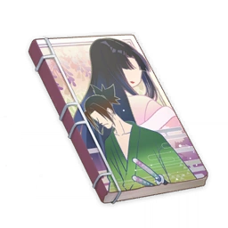

# Princess Mina of the Fallen Nation

  
## Vol. 1

!!! note
    The princess who was prophesied to bring destruction witnesses the imminent fall of her nation, and it is at this moment when a wandering warrior descends from the skies, ignorant of the truth.  
    The pair's journey amidst the fires of an ancient warring period are about to begin!  
  
Thirteen years of peace were had before the era of warring states began.  
The nations of the north, furthest from the epicenter, at last became infected by the spirit of the age, hurling themselves into the flames of war.  
As it is with most wars, a loser would be decided after a fierce conflict. Their cities were cast down into flaming rubble, and their nobles and their supporters fled into the mountains.  
Such a backdrop is hardly anything special.  
  
But into that inflection point of an era strode a wandering samurai dressed in luxurious robes.  
No, rather than "luxurious," perhaps it was more accurate to say that these robes were...  
Yes, that's right. It was a man dressed as a woman.  
In contrast, this samurai was accompanied by a petite girl wearing a haori that was large to the point of incredulity.  
In any case, they were a suspicious pair for sure.  
However, the two of them sauntered up to the checkpoint at the foot of the mountains as if unaware of this fact.  
Of course, they were immediately stopped by the ashigaru guarding the checkpoint.  
"Who are you?"  
This was a standard thing to say, but it was also an honest question in this case.  
"As you can see, we're just ordinary passers-by."  
It was a reply with no powers of persuasion.  
But the ashigaru who asked almost seemed to hesitate at the sheer lack of doubt in the samurai's tone.  
"Well, uh, could I ask you to come with me anyway?"  
"Ah. That didn't work, huh..."  
The samurai almost seemed disappointed. Suddenly, three ashigaru fell to the ground.  
"You planned to do this all along, didn't you? You horrible knave."  
The girl grumbled softly from the rear.  
  
## Vol. 2  

!!! note
    "A princess who brings destruction. Hah. Isn't that just an excuse for making war?"  
    They travel to the center of the world in search of the truth behind the prophecy.  
    The super-popular romantic adventure continues!  
  
"That's not it."  
These words burst out suddenly.  
In the nameless mountain shrine, the black-haired princess sat still, her face flickering between light and shadow in the face of a flame.  
"What do you mean 'that's not it'?"  
Came the reply, almost as a conditioned reflex.  
"What I mean, you dumb samurai, is: don't you have any thoughts concerning me, the princess who brings destruction?"  
"Thoughts? Well, I think you're quite the character, for one."  
"I don't mean 'thoughts' in that sense." Princess Mina sounded quite exasperated now. "I mean with regards to saving me."  
"Strictly speaking, I didn't save you."  
The samurai corrected.  
"At that time, you ordered me to take you away in your capacity as princess. In that sense, you saved yourself."  
"Oh, is that how you see it?"  
An expected reply.  
Well, the samurai thought, it had been worth a shot trying to dodge responsibility.  
  
"In any case, this 'princess who brings destruction' nonsense... Hah. Isn't that just an excuse for making war?"  
The samurai's lackadaisical tone shifted.  
"Also,"  
The samurai turned around, void-like eyes now aflame.  
"'Destroying the world' is an utterly stupid concept. You'll understand soon enough."  
  
## Vol. 3

!!! note
    The two, who have entered the field of battle, finally witness the true Avici. The truth behind the fires of war that have swept across the world will be revealed here!  
    This volume comes with some super value-added extras!  
  
People call war hell, but most are just describing it as such.  
But what appeared before their eyes could only truly be called "hell."  
The desolate earth, the withered trees, and people like the shambling dead.  
It was like the life had been wrung from this place.  
"Huh."  
The samurai picked a husk of a leaf. It crumbled into dust immediately, floating away on the wind.  
"It seems like the life has literally been wrung out from this place."  
  
Conflict had raged around the capital for over a century now.  
After the first decade, the resources and riches of the various warring nations had already been all but spent.  
The thing that had sustained the bloodshed for so long was something known as Nakura's Hex.  
Nakura's Hex was a terrifying sorcery that sucked the life of all living things and the land itself dry, giving it unto powerful samurai and feeding the war effort.  
And those who used such depraved magics to dominate the land were scoundrels known as the Nakura Daimyo.  
The Daimyo vied for dominance, but no matter who won, the earth would be further robbed of life.  
This was the true face of the war that had raged for nearly a century now.  
"And the ones who created the Hex are the Onmyouji who dwell in the Sky Tower at the center of the world."  
  
Ignoring Princess Mina, who had wavered at the sight before her eyes, the samurai continued faintly,  
"O 'princess who brings destruction'... Has this world not already been destroyed?"  
  
## Vol. 4

!!! note
    "Go back to hell, you jumped-up vengeful spirit!"  
    The riveting flashback chapter! What lies within the warrior's buried past?  
    Here comes a new chapter in the adventures of the princess who lost her nation and the warrior!  
  
The nation of Kogami — a lifeless wasteland as far as the eye could see.  
The barren fields stretched out into the horizon around a large sand dune where the two samurai faced each other.  
One of them is our protagonist, and shall be named the green samurai to distinguish him from his compatriot.  
The other is a new arrival to the story. We shall name him the pale samurai.  
If this were a swashbuckler's tale, then they would have already taken up battle stances. But the two were not here to have a decisive match. They were just facing each other.  
  
"Came back from hell, did you?"  
The pale samurai said, the weight of time unknowable lying between them.  
"Nostalgic, isn't it?"  
The green samurai seemed quite happy.  
"I don't get nostalgic over such things."  
The pale samurai interrupted rudely.  
The green samurai closed their eyes, as if sinking into the abyss of the past.  
  
"'This will all end as long as we defeat the evil overlords.' That's what we believed then. Naive fools that we were — that was just the beginning of the nightmare."  
"The thirteen samurai banded together to defeat the Nakura Daimyo who had been destroying this nation."  
"But Kogami did not revive with the Daimyo gone, and the life-force of the land continued to bleed away."  
"Not only that — Kogami, now bereft of its ruler, became a paradise for those who would plunder it."  
"The heroes who had defeated the wicked overlord could not protect it in the end either."  
"In the end, only two escaped."  
"...Hey now, cut the reminiscence out for a second. We've got things to settle, don't we?"  
  
## Vol. 5

!!! note
    "If this world requires your sacrifice to be saved, then it might as well burn."  
    Having reached the Sky Tower at the heart of the world at last, is this... finally the end of the pair's tale?  
  
"I want to save this world!"  
Princess Mina said.  
"I've told you this many times before. There's no such thing as 'saving this world.' Now, this hasn't stopped idiots like me from trying, of course. But this world... it's doomed."  
"I don't care. I'm a princess. Aren't princesses born to save the world?"  
"No, I've never heard of any story that goes like that. And last I heard, you were the princess who brings destruction."  
"Last I heard, someone said that this 'destruction' is actually the birth of new life."  
"Well, I don't where you heard that one, but such beliefs are old hat by now. If you wrote this drivel nowadays, people would chuck it into the nation of Tokoyo, and that would be for the best."  
(The Princess covers her ears)  
  
At the top of the Sky Tower, the samurai and princess argued in futility, as if no one was watching.  
Well, I say that, but in fact there were quite a few other folk about dressed in the garb of onmyouji.  
"So, uh, as you all know, Nakura's Hex was originally created to preserve the vitality of a world that was slowly declining."  
As if unable to stand the conversation — and also to push the plot forward in their role as an NPC — the oldest onmyouji finally spoke.  
"And that which can utilize this stored vitality..."  
  
"So, could you get these thoughts out of your head?"  
The samurai didn't seem to have heard the wizened onmyouji at all.  
How long was this farce going to continue?  
  
## Vol. 6  

!!! note
    The truth of the world is revealed — and what a terrible joke it is! Even when separated, the two cannot escape the chains of fate.  
    This may be the final volume of "Princess Mina of the Fallen Nation," but our story isn't over yet!  
  
"So, was the world saved?"  
At the story's end, the samurai walked amidst the boundless desert.  
The Sky Tower's plans were probably complete by now, and vitality remaining in the world had all been stored up.  
There was no knowing if a new world had been created, but this one was most certainly done for.  
Ah, what could one expect of a princess destined to destroy the world?  
"Might as well destroy another world... if it exists."  
And so the samurai embarked on a new journey.  
  
...  
  
(The remainder of this book concerns the story's setting, and features in large part the various wicked overlords and monstrous creatures that did not appear in the main narrative of the novel.)