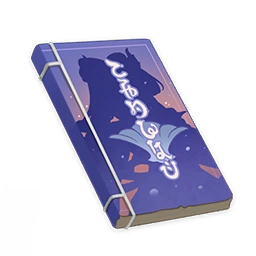

# Sangonomiya Chronicles

!!! note
    Historical annals written by the famous Shogunate historian Kujou Michizane, who was known as one of the "The Three Kujou Dignitaries," or "The Great Calligrapher." It chronicles the history of Watatsumi Island in broad strokes.

Sangonomiya was once an ocean abyss, until the Great Serpent came, forming a vortex with its spiral movements, and fashioning the coral into an island. Thus the people of Sangonomiya named their island Watatsumi, meaning "god of the sea," for the Great Serpent was their god.

The inhabitants of Watatsumi call themselves the people of the sea and worship the Great Serpent as the Orobashi no Mikoto. On Watatsumi Island, the shrine is the seat of government, and there are no commissioners appointed by the Shogunate. All business, great and small, is conducted by the shrine maidens. The head shrine maiden, or Divine Priestess, is the head of government and ceremonial affairs.

During the Archon War, Her Excellency the Almighty Raiden Ogosho brought all of Inazuma under Her unified rule. The masses bowed down in fear and awe and each was content with their lot, else they were annihilated. No longer did any covet that to which they were not entitled. The Great Serpent, Orobashi no Mikoto, had always remained in the western region and respected the boundary between itself and the Narukami, and the two had lived in peace. But now, it suddenly transgressed the boundary and invaded the east without warning.

The war was brutal, and brought great suffering to the people. The two sides fought bitterly on what is now known as Yashiori Island, with many casualties and injuries on both sides. Her Excellency's cherished tengu general, Sasayuri, was among those who lost their lives. Finally, the Great Serpent was slain by the Ogosho where its remains now lie on Yashiori Island.

Thereafter, Sangonomiya sent envoys to announce surrender, and they have recognized the Inazuma Shogunate as the legitimate and supreme ruler ever since.