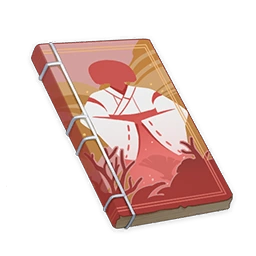

# The Life of Mouun the Shrine Maiden

!!! note
    For the people of Watatsumi, the legends of the Archon War are always filled with bitterness. Many of these millennia-old folksongs tell of a shrine maiden by the name of Mouun, who once rode upon the back of a sea monster, following the Great Serpent unto a tragic, moving end.
  
The shrine maiden Mouun was born to the Yuna Clan. This clan was one of the great houses that first followed their Omikami out into the sunlight, and is still known today for their traditional talent in whalesongs and their closeness with all marine life. Mouun entered Sangonomiya Shrine at a young age and would learn the etiquette and ritual arts of the Watatsumi shrine maidens, history, governance, and the island folk-tunes. Her younger twin sister Ayame, who in later days would be known as "Umigozen," was a female diver, making a living through collecting pearls.  
By the time news that the Shogunate had unified all the Inazuman islands reached Watatsumi, Mouun and Ayame were already quite famous among the island's people. In the folk-tunes that still persist till today, Mouun was a wise and gentle soul who helped to steer the people away from meaningless conflict, while Ayame was valiant and cheerful, her power sufficient to wrestle against fierce sea creatures.  
  
When Watatsumi Omikami ceased in his hesitation and embarked on that hopeless eastern expedition, Sangonomiya's first navy was entrusted by the then-Divine Priestess to Mouun and her sister. This was also the beginning of Mouun's association with the giant whale named "Daikengyou."  
  
Legend has it that Daikengyou was a huge blind whale that had lived for five hundred years and four hundred years before that. The dark depths of the ocean floor were its home, and the fishes of the deep and the moonglow-beauteous jellyfish were its faithful servants. Five hundred narwhals guarded its left flank and five hundred humpback whales played music to its right. Some folk-tunes claim that it could have swallowed ten coral islands in one gulp before spitting out five skerries in its deep, satiated slumber.  
  
Even amongst those of the Watatsumi people who were skilled in whalesong, none had faced this titan and returned whole to tell the tale. But at the Divine Priestess' direction, Mouun dived deep into the whale's phosphorescent palace just as the moon rose high enough to pierce the ocean mists. None knew how Mouun persuaded Daikengyou to join her. But on the third moonrise after her departure, when the waves drew back from the shore, the people witnessed Daikengyou surface from the tranquil ocean, shimmering with silver light as it bore Mouun on its back.  
  
Later, Daikengyou and its marine courtiers would follow Mouun and her sister into battle at Omikami's side, though the battle ultimately and inexorably went ill...  
Mouun made to retreat when she heard that Omikami and Touzannou had been slain together, but she was ambushed by the tengu Sasayuri's subordinates en route and was herself slain together with Daikengyou the mighty whale, their remains captured by the Shogunate. As for her sister, "Umigozen" Ayame, she disappeared into the blood-red ocean after a valiant stand, never to be seen again.