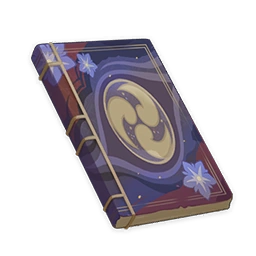

# Treasured Tales of the Chouken Shinkageuchi

## Vol. 1

!!! note
    The first part of a traditional Inazuman novel. This particular volume is also known as "Shinkageuchi," and was once a restricted text. It contains a fantastical tale about the first Raiden Shogun and her kagemusha, depicting the benevolent sagacity of the first Shogun and the great valor of her kagemusha. However, due to the great popularity of another book known colloquially as "Raiden Reincarnation," many people became interested in stories of this kind. This book thus wound up being published in a haphazard manner.
  
It is often said that the "drawn bow is like the quartered moon, and studying the blade is like a circle of transparent jade."  
  
It is said that when Narukami came to her people, she brought with her the knowledge of crafting swords. After thousands of years and hundreds of bountiful harvests, mortal swordsmiths were at last able to make swords that would please even Narukami herself. Thus did the Grand Shrine and the Shogunate enact this divine ceremony: they collected the greatest swords in the world and offered them up to the shrine, thus naming these blades "Goshintou." This ceremony was a very lively one indeed, and the practice persists to the present period. However, there are many behind-the-curtain matters concerning the "Goushintou" that few know of.  
No famous craftsman merely forges one blade in one sitting. The greatest of their works are known as "Shinuchi," and are given a lovely name before being offered to the craftsman's lord or deity. These are not built for taking lives and are to remain pure. The others are known as "Kageuchi" and will be given to retainers for them use as weapons. These will often be used to shed blood and will thus be stained with impurity and filth.  
  
From the day Narukami Gongen, the First Shogun, began her dominion over the land of Inazuma, she was accompanied by her younger twin sister. "Shin" and "Kage," light and dark they were, mediating and holding court, ordering and giving battle. The younger of the two was named "Ei," and if her name were to be written plainly, it would likely be the word for "shadow," which she was in relation to the first Shogun, to whom she would become the successor.  
As most know, only The Seven emerged from the wrack and ruin of the war that rolled across the mortal world like a crimson storm. Though the Shadow Shogun was divinely skilled in martial arts and unsurpassed with the blade, she believed herself little more than a warrior with little understanding of mortal hearts. Thus, she chose to give up her bodily form, helping her sister to ascend to the "heavenly citadel" and obtain dominion over Inazuma. Shortly after, the True Shogun, "Makoto," set up her Shogunate and began to rule over the land. Remembering their bond, she recalled "Ei"'s divine will and reforged her body, thus returning her sister to her side once more as her kagemusha.