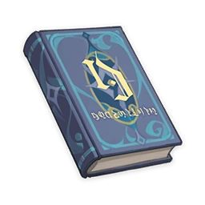

# Along with Divinity: Prologue  

!!! note
    "Have you ever thought about what our lives would've been like without the archons?"  
    Come and join the author in an exploration of "divinity" with humor and logic.
  
When our perceptions are unfettered by archons and churches, we shall learn that in northern Teyvat, the people of Mondstadt preserved their culture as decades ago, even after Barbatos the Anemo Archon concealed himself. When we observe the daily lives of the people of Mondstadt from a higher perspective, it is evident that the people share a carefree nature, which mostly stems from their bountiful and pleasant living conditions. The surplus grain produced became their source of brews, and the brews further nourished their easygoing temperament. Above all, the Anemo Archon never taught them how to make wine and revel — they discovered it themselves.  
But I do not intend to make my readers think that we could do without archons. On the contrary, say, if Barbatos had not guided the warm monsoons to Mondstadt with his divine powers, would Mondstadt still be so bountiful as to produce the brews that it does?  
The answer would be no. Mondstadt is an inland city and would have struggled to provide for itself if not for the grace of Barbatos. If we look back through history, we learn that Mondstadt is situated on a land that was once frozen, where the living conditions were harsh and brewing would be virtually impossible. It was the power of Barbatos that changed everything.  
A cumbersome preface indeed, but I hope that my readers will keep one thing in mind when reading my humble book: while it is the power of archons that created our living environment, we should be conscious of the fact that what shapes our thinking, logic, culture, philosophy and aesthetics is not the archons themselves, but the objective environment that exists around us.  
This world around us is what we have inherited, and what this book shows is that the people of Teyvat have always been, and always will be, heirs to a divine legacy — but not to divinity itself.