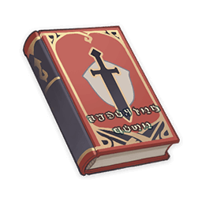

# Ballads of the Squire  

  
## Vol. 1  

!!! note
    Ballads that have been passed down since the aristocratic period and are said to come from Ragnvindr the Dawn Knight himself. They tell of Ragnvindr's days as a knight's squire.
  
Down every street in Mondstadt have I strolled.  
The air was filled with the stench of misery and the buzz of revelry.  
I saw the most arrogant of aristocrats,  
And I saw the most pitiful of the impoverished.  
At night these streets are a spider's web—some here to feast, others their eternal prey.  
I hear a jangling in the night, and know it is the chains that fetter the souls of the oppressed.  
  
I patrol the streets of Mondstadt at nighttime,  
Where my peers and superiors would once declare:  
"We are the starlit knights, lift thy heads and bear witness!"  
"For we, who raise our flag in the splendor of starlight, are the true protectors of Mondstadt!"  
But not once have I lifted my head to the stars, or gazed at our flag:  
For I cannot shift my focus from the filthy street corners.  
  
Destitute peddlers weep in silence.  
Aging soldiers grimace in pain.  
In the deathly stillness of night,  
A young girl, rejected by the Aristocracy, pleads for Barbatos' mercy.  
The sighing of mournful winds rattles the Cathedral gate,  
Carrying within them the grief of the oppressed, they assault splendid palatial walls.  
  
Each mother's call,  
Each infant's cry,  
Enough to dent the hardest of shields.  
Enough to shatter the sharpest of swords.  
  
Sounds of sorrow send shivers down my spine.  
But in the palace, and in the castle,  
Though the wind blows the same over holy ground,  
They are but the sighs of ants to the ears of men.  
  
## Vol. 2  

!!! note
    Ballads that have been passed down since the aristocratic period and are said to have come from Ragnvindr the Dawn Knight himself. They tell of Ragnvindr's friendship with a sword-dancer.
  
One day, at the crack of dawn,  
A dancer whose sword was her song set foot in Mondstadt.  
Though clad in chains with cuffed hands and fettered feet,  
In her silence lay a song:  
It was the song of freedom. A song of a brighter dawn beyond the walls,  
A joyous ballad sung without reservation by a people unrestrained.  
  
She was the dawnlight of the Wanderer's Troupe,  
But she spelled eternal midnight for the Aristocracy.  
I once asked her, "Why do you come to overthrow our aristocrats?"  
"Do you not know that they are the first among us?"  
  
"Wherefore do you place their lives on a pedestal?"  
Came her voice, like a fresh breeze,  
"If you claim to know the wind as your companion,"  
"Then did you not once know freedom, too?"  
  
To her lonesome listeners she told a tale:  
A tale of our rulers' better ancestors who held divine power,  
A tale of angels, gods and vile dragons,  
A tale of the deities and peoples of all the land.  
Each myth and legend she turned to song,  
And the wind carried the song to all corners of the land.  
  
In the aristocrats' arena, her sword sang once more:  
Her final masterpiece, but it stopped short of perfection.  
A nameless knight retrieved her sword from the blood-soaked battlefield.  
And buried it where the gentle winds meet in communion.