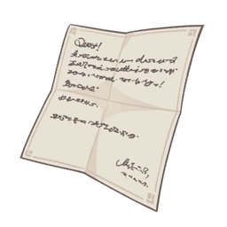

# Draft Hilichurl Ballads  

Author: **Ella Musk**
  
## Vol. 1  
  
!!! note
    A Hilichurlian poem created by Ella Musk. According to her, this Recital of Friendship is the work of many hands. Still, you can't help but feel that something sounds a bit off when you read it...

Olah! Olah!  
Yoyo mosi mita!  
Nye, nye mosi mita,  
Yeye mosi gusha!  
Mosi gusha, mosi tiga,  
Yeye kucha kucha!  
  
## Vol. 2  

!!! note
    A Hilichurlian poem created by Ella Musk. According to her, this Stirring Narrative is the work of many hands. Still, you can't help but feel that something sounds a bit off when you read it...    

*Volume currently unavailable.*  
  
## Vol. 3  

!!! note
    A Hilichurlian poem created by Ella Musk. According to her, this Elegant Lyric Poem is the work of many hands. Still, you can't help but feel that something sounds a bit off when you read it...

*Volume currently unavailable.*