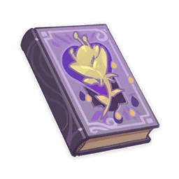

# The Legend of Vennessa

  
## Vol. 1

!!! note
    A popular song since the reconstruction of Mondstadt. It tells the story of Vennessa, the founder of the Knights of Favonius, in her early years as a slave in Mondstadt.
  
Friends of Mondstadt, let us revel! Drink to your hearts' content!  
To freedom! To the Anemo Archon!  
To Vennessa, the first Knight to grace this world!  
Sons and daughters of Mondstadt, may the gift from the Anemo Archon be engraved in your hearts!  
And let it be known that this gift is not freedom, but just defiance!  
  
It transpired in ages past.  
Friends, do excuse me for improvising,  
For it should be clear as day, that the glory and freedom of Mondstadt  
Were born when Barbatos struck the strings dolce.  
Poems sing of heroic fame,  
Yet to commemorate unnamed freedom should they aim.  
  
Chained by royals, Mondstadt could barely suspire,  
And festivities were but vanity games of the rich,  
Beyond the grasp of the ordinary people.  
A withering dungeon, Mondstadt was.  
In slavery games the royal gaily relished,  
Oblivious to their place, the inmates were.  
  
A fiery-headed dame confined to a cell,  
From the southern plains she did hail.  
Born free but now bound by chains,  
Though restrained by a tyrant her flesh remained.  
Still her pious soul never ceased to pray,  
For her people, for Mondstadt, for illusive freedom if she may.  
  
## Vol. 2

!!! note
    A popular song since the reconstruction of Mondstadt. It tells the story of Vennessa, the founder of the Knights of Favonius, in her early years when she met Barbatos, the Anemo Archon, as well as how she defeated the drake and overthrew the Aristocrats.
  
Friends of Mondstadt, let us revel! Drink to your hearts' content!  
The day came when Barbatos answered her devotion.  
The Anemo Archon sought her fiery hair and descended to her position.  
"Every being deserves a name," the spirit grinned.  
"To weave your fair name into a song I yearn,"  
"I seek nothing but your friendship in return."  
The girl happily reciprocated, her fears swiftly dissipated.  
  
And so, to the battlefield she marched to Barbatos' singing voice,  
The demonic dragon fled from her might and the people did rejoice.  
Corpulent aristocrats crawled under tables at such a valiant sight.  
"Mondstadt is freedom," the winds sang for their people in delight.  
Lonely forest breezes converged, jointly they overthrew the tyrant's tower from the sky.  
Broken free from shackles at last, the young lioness stood firm in the winds with her head held high.  
  
And so, the fiery-headed dame won herself prestigious fame.  
Her heart swelled with appreciation to sing by the Anemo Archon's side.  
But no words of gratitude should she utter, Barbatos replied:  
"You first conducted what now transpires in your song."  
"You have entrusted me with your friendship and your name."  
"To praise your freedom, my songs came."  
  
Friends, let us drink some more!  
For thence flows the freedom of Mondstadt.  
When days become nights and faces fill with despair,  
Never forget the heroic tales of Vennessa, the dame with the flaming hair!  
Never cease to pursue freedom, even when the land is bare!