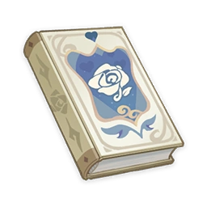

# The Pale Princess and the Six Pygmies

## Vol. 1

!!! note
    A fairytale story that has been told throughout Teyvat for ages. This is part one, which tells the story of the Land of Night and the Moonlight Forest.
  
In the distant past, the Night Mother ruled over the faraway Land of Night. Here, no light touched the earth, nor did a single tree grow, and there was no life here but the horrendous denizens of the dark.  
The Night Mother was the source of all sins, and the Land of Night was the embodiment of her evilness. The cruel Night Mother, who had neither heart nor mouth, was always watching the Land of Night, and her punishments were always unexpected. The only thing she could not bear was the occasional ray of moonlight that made it through the clouds. The light that penetrated the walls of darkness always irritated her.  
The Moonlight Forest was the only place free from the rule of the Night Mother. Only there could the people bask in the bright moonlight and enjoy the grace it brought to the living. Everyone in the Kingdom of the Moonlight Forest was born with fair skin, light-colored hair, and bright blue eyes. Perhaps the constant lack of sunlight and the nourishment of the moonlight was the reason for their beauty, giving them an appearance different from the abhorrent creatures lurking at the edge of the forest.

## Vol. 2

!!! note
    A fairytale story that has been told throughout Teyvat for ages. This installment tells of the meeting of the Pale Princess and the Light Prince.

*Volume currently unavailable.*

## Vol. 3

!!! note
    A fairytale story that has been told throughout Teyvat for ages. This installment tells of the Pale Princess and the Light Prince's decision to save the Moonlight Forest.

*Volume currently unavailable.*

## Vol. 4

!!! note
    A fairytale story that has been told throughout Teyvat for ages. Installment four describes the meeting between the Pale Princess, the Light Prince, and the Six Pygmies.

*Volume currently unavailable.*

## Vol. 5

!!! note
    A fairytale story that has been told throughout Teyvat for ages. In this installment, the Six Pygmies' sinister scheme starts to unfold.

*Volume currently unavailable.*

## Vol. 6

!!! note
    A fairytale story that has been told throughout Teyvat for ages. This installment tells of how the Six Pygmies managed to implement their nefarious plot.

*Volume currently unavailable.*

## Vol. 7

!!! note
    A fairytale story that has been told throughout Teyvat for ages. The final installment brings everything to a conclusion, and includes the Night Mother's prophecy.

*Volume currently unavailable.*