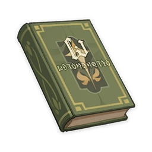

# Vera's Melancholy

## Vol. 1 - Endless Days in Infinite Worlds

!!! note
    I don't think the world is monotonous. It's just that interesting things happen in far away galaxies.  
    The great adventure of Vera, an ordinary girl always fascinated by distant lands, secretly begins.

"There are times when I think to myself... There's nothing to do in this tiny village. What a dull place to live."  
This wasn't the first time that Vera had complained about her hometown, the small country village of Delphi. Her frown eased slightly as she lay on the hillside near the village, eyes closed, feeling the breeze of the early summer.  
"Then where in this world would you not consider dull?" Her buddy Sachi asked curiously.  
Vera sat up and leaned forward.  
"I believe on the other side of the Starry Sea is a planet inhabited by gods who can answer all prayers and wishes, and everyone bearing a wish is on a journey to get there. I believe, in our universe, there is a world currently in a war against doomsday, where the noble and elegant souls of fourteen Valkyries burn bright, if only for a brief but magnificent moment..."  
"You've been reading too many of those weird fantasy novels."  
"But... this village really IS dull. When was the last time anything fun happened here?"  
"Funny you should say that, a new family did move into our village recently..."  
"Novelty and fun aren't the same thing!"  
Despite what she had said, Vera decided to pay a visit to the newcomers. Sachi, however, remembered his family's rules, and walked back home for dinner.  
  
...  
Vera gave the door to the newcomer's abode a gentle push. Much to her surprise, it wasn't locked.  
"Anybody home?"  
No sooner had the words left her mouth than the living room cupboard doors flew open and out jumped a black-haired boy wearing glasses. He was followed by a tentacled blue slime.  
"Make way! Tal, why did you let a stranger in?"  
The black-haired boy gently pushed Vera out of his way and picked up an axe by the door.  
"You leave me with no choice. Since you have seen everything, there is only one thing for it..."  
Thus began the biggest crisis of Vera's life.  
  
## Vol. 2 - My Backyard is Slightly Bigger than the Entire Universe

!!! note
    Everything's just boring. Everything, all the time. It's not depression. It's just reaching the age of 14.  
    So begins Vera's adventure.
  
"All I can do now is ask you to help me." The black-haired boy, who called himself Ike, handed Vera a kitchen knife.  
He walked back to the cupboard and began slashing at the tentacles frantically.  
"Come and help me close this door! If a tentacle starts attacking you, use this kitchen knife to defend yourself!" Ike's glasses were now covered in blue slime. "Hurry! We can't let this evil demon cross into Delphi."  
Upon hearing his words, Vera helped Ike close the door. While they were pushing back the tentacles, Vera accidentally stabbed Ike twice in the back. Thankfully, Ike's healing spells were quite potent.  
"I shall explain everything to you. I am in fact over a thousand years old, and this door is a gateway to anywhere in the universe. That tentacled monster is an old one from the Large Magellanic Cloud — I went there to get something." Ike was covered in slime from head to foot by this point. He wiped his glasses with Vera's dress as he spoke. "Erm... is there anything else that you'd like to know?"  
"Who's Tal?" Vera didn't seem to mind.  
"An evil spirit that resided in the man-devouring castle. It has served me as a butler since I subdued it. Strangely, it behaved quite friendly towards you."  
  
Vera's parents always reminded her that people are destined to build families, and that it was futile to entertain dreams of anything beyond the homestead. Her buddy Sachi once told her that if a lively girl like her was to marry someone from a faraway land, the whole village would become unbearably lonely.  
(The real reason Sachi said this was that he was something of a weakling, and was sure to be ferociously bullied if he ended up having to play with the boys.)  
"The human spirit is still too immature. I need to guide you both through the wonders of your childhood." Ike extended his inviting arms to Vera. "You will sing every step of the way on your long journey to youth."  
From the Orion Arm to the Eternal Jahanam, from the Torrents of Time to the depths of the Starry Sea...  
"How far is 'beyond'? Any place in this universe is just as boring as my backyard," he said.  
"The scale of everything beyond follows the heart," Ike replied. "Thus, my heart is slightly bigger than the entire universe."  
  
## Vol. 3 - The Man Who Stole the Lone Star

!!! note
    The Andromeda Empire stretches across half the galaxy group. Every planet within the Empire has its own demons and deities, dragons and monsters.  
    "I've come up with a story for every star from your home."  
    "That's not possible. Looking from here, the Andromeda Galaxy is only one fifth the size of your moon."  
    So continues Vera's adventure.
  
"I am the second rightful heir to the Andromeda Empire, and I have more than two hundred titles to my name. You shall call me the Princess Andro-Basilisks." The charming girl then crossed her arms, savoring the moment of her entrance in her mind and giggling to herself in amusement.  
Her sole reason for gracing Delphi with her presence was to marry Ike.  
"If you, he who conquered a quarter of the universe, marry me, my safety shall be guaranteed after my elder sister takes the throne."  
"If I may ask, how big is the Andromeda Empire?" Vera asked.  
"I reckon there are more than nine thousand inhabitable planets."  
——With so many stars in your possession, why come to steal my brilliance?  
  
"So you aren't here to harm Vera?" Sachi cautiously asked Ike, who was carrying the scrolls and globes of other planets.  
"Of course not. I think she would make a great assistant." After putting everything down he clapped his hands. "You like her?"  
"Me? No, not at all, I don't like her at all!" Sachi looked away, worried that the old sage might discern his true feelings.  
He reached for a box full of photo frames. He grabbed a few at random, each picture depicting a different beauty.  
"Look at them... They all said that they gave me their one and only true love, but did they? In reality, I was just one of their many lovers."  
Sachi did not know when or where he had heard the saying, but it blurted out from his mouth in his moment of annoyance:  
"With so many stars in your possession, why come to steal my brilliance?"  
  
## Vol. 4 - All that Glitters

!!! note
    There is a saying that goes as follows: Not all that glitters is gold, sometimes it is the outpouring of a broken heart.  
    Either way, the stars in the sky certainly aren't made of gold, and most people's hearts aren't made of glass.  
    In any case — here is the next chapter of Vera's adventure!
  
"The people in these photographs are all so pretty," Vera exclaimed as she picked up Ike's box of framed photos.  
"Of course they are — otherwise, they wouldn't have had the chance to leave me with a photograph to remember them by."  
Ike has no intention of evading. After all, he was a galactic sage who was over a thousand years old. So of course he knew that girls were easily hurt, and that they could become trouble very easily. Ike would thus never cheat a girl — take notes, boys.  
"Having seen the starry host, I thus make star-shaped jewels to remember them by," he continued to explain. "But those stars that shine across the universe do not belong to anyone. So it is also impossible to steal them."  
Vera did not understand. "What are you saying?"  
"I'm saying this for the sake of a foolish fellow who isn't present right now. Pay it no mind, humans are just far too young."  
  
"I will serve as a go-between between you and Ike." Sachi said to the Princess of the Andromeda Empire in a loud voice.  
"Huh?"  
"I love Vera, I don't—"  
"Disgusting. Boring. Be silent, worm. You are an offense to my ears. I've already acknowledged Vera as my friend. I will not hand her over to a cowardly person like you..."  
"Wh—What..."  
  
## Vol. 5 - Roadside Picnic

!!! note
    You can't have picnics on the sides of a galactic highway! Even the deities will be held fully responsible for road accidents that might occur! The doorway to a study in a simple village connects to anywhere in space and time!  
    Having hide-and-seek across time... Vera's great adventure continues!
  
When Ike was taking a nap, his servants waged a terrible war against each other.  
The great wizard had subdued many gods and demons to serve under him. As the most formidable wizard of his day, Ike was in command of gods and demons more numerous than the entries in a dictionary. But who was the strongest of those under his rule? The gods and demons decided to find out for themselves through battle.  
Unfortunately, they seemed to have erroneously regarded as their own three who were neither gods nor demons: the Princess, Sachi, and Vera.  
Ike only slept for two hours, but in that time three stars had already been destroyed!  
  
"Why should I protect you?" The Princess pulled her hand away, and the giant demon plummeted to the ground, its eyeballs gone.  
The dominant race of the Andromeda Empire may look lovely and sweet, but on their palms grow two special mouths, which they use to devour the eyeballs of their lovers and those they vanquish.  
"Are we no friends?" Vera wiped the blood off her face, and appeared to be hurt by the Princess' words.  
"Yea - yes," The Princess blushed and looked away. "I already regard you as my only friend for what has happened. I was not referring to you, Vera."  
"No!" Sachi yelled as the gnarly jaws of a dragon closed around him.  
"Do you surrender to me now?" The giant dragon jeered. "Surrender and concede that you are worthless, lowly rats, and I shall let you live!"  
"I surrender! I surrender! Let me go!" Sachi screamed.  
"Why, a lizard of your despicable breed should know better than to utter such foolish words! Even the geckos in my palace could crush you." The Princess gave her wrists a twirl.  
"No! This has nothing to do with me!" Sachi yelled as the dragon cast him into the sky.  
And just like that, the battle between the dominant species of Andromeda and the ancient giant dragon was over.  
  
The moral? You won't get hurt if you just surrender.  
Sachi was knocked out of the contest and woke Ike up with the slap of a slipper. Vera also survived thanks to the protection of the Princess.  
"Argh! You imbecile! The mere sight of you is revolting. Do not come near me! Don't talk to me, don't look at me, nor breathe the same air as me, you lowly scum!" The Princess could not have a lower opinion of Sachi.  
  
## Vol. 6 - For Every Season

!!! note
    There was once a great scholar who wished to write a book about all the festive days of the empire.  
    After looking into it more closely, he discovered that every single day had some sort of a festival associated with it... He persevered with this monumental writing task for six months before giving up on it.  
    But don't worry — as far as this book is concerned, I am the author, and I won't let my readers down!
  
Though those things had indeed happened, they were occurrences on a galactic scale. Now, something more mundane was about to happen. The date of the town festival was drawing near.  
"I suppose it's finally my turn to introduce you two to this small town, then?" Vera said as she served the Princess and Ike her very own braised dishes.  
After all, those things they had encountered in their galactic escapades had to be explained by the Princess and Ike. If there was any knowledge Vera had to present to them, it was the knowledge of her hometown.  
"...Afterward, the great king's first messenger, the brave knight Huffman strode west across two continents, crossing great oceans and rivers. As for the imperial sage, the witch from the east, she passed by her hometown on her road eastward, and then came by the land of the Nether. Thus, they finally met here."  
"Huh, is that so. How interesting." Though she was trying hard not to let Vera notice that she did not in fact care for the story at all, the Princess' acting skills required some work.  
"So that can only mean that this place is on the polar opposite side of this world from the great king's capital, right?" Ike said, commenting on a seemingly unimportant aspect of the tale.  
"Ahahaha, that's true if you think about it." Vera rubbed the back of her head with a crooked smile.  
  
"I've always said that I want to leave this place, but in the end, I discovered that this is the place I'm most familiar with." Having come to this realization on the eve of the town's anniversary, Vera began crying right in front of Sachi's eyes.  
"You numbskull! You made Vera cry!" The Princess made her entry with a flying kick, sending Sachi hurtling away.  
  
## Vol. 7 - Galaxy Wars

!!! note
    In the star clusters at the outer reaches of the universe, habitable planets are few and far between. For this reason, the region is the playground of space captains and pirates alone.  
    With this being the universe, though, there is no port and starboard in the traditional sense — out here, "starboard" means whichever side of your spacecraft is oriented towards the star you are using for navigation...  
    Lose yourself, and especially you sense of direction, in this next chapter of Vera's starbound voyage!
  
"Re-igniting a sun is not difficult, but I don't think the Andromeda Empire would like to see that happen," Ike said to the panicked Vera.  
"Do you mean that the Princess has kidnapped Sachi?" Vera said with some shock in her voice after giving the matter some thought.  
"How did you come to that conclusion? I'm saying that only the Andromeda Empire would be capable of kidnapping you and the Princess." Ike then turned to face the innumerable lives that dwelled within the galaxy.  
He paused for a moment before declaring thus: "Inhabitants of the galaxy. Though I have come here upon the invitation of the High Saint King Lebannin to re-ignite the flames of the few remaining stars, it seems the Andromeda Empire does not wish for your longevity, and has thus kidnapped my friend."  
"Are you then to put their lives over that of all life?" Saint King Lebannin arose from her seat. "If that is the case, why then do I rule over these stars?"  
  
Finally, the Saint King would charge into peril alone, defeat the assassins from the Andromeda Empire, and rescue both the Princess and Sachi. Afterward, she had a few words with Ike.  
"I didn't think you could defeat the dominant species of Andromeda," Ike praised.  
"They're a strong and hardy race. I suppose it's true, the, that you defeated the holy dragon en route to becoming the Saint King."  
"I am, in fact, that same holy dragon. I fused with Lebannin's flesh and blood, and now act according to her wishes."  
"Huh..." Ike was a little shocked by this.  
"Ah, yes. Is that the fellow the person the Second Princess is fond of? When I barged in, they were..."  
"What!?" Now that was a much bigger shock for Ike.  
  
## Vol. 8 - The Girls Themselves

!!! note
    Of course boys aren't invited to the girl's slumber party! Girls are sacrosanct, like the gods of the golden age.  
    Vera, the Princess, Saint King Lebannin, and Ur, alpha female of the Galactic Swarm, shall talk deep into the night!
  
"I said it was a misunderstanding! She was about to eat me." Sachi explained.  
"I don't think she was intending to eat you," Ike said, pushing his glasses up. "The dominant race of the Andromeda Empire have organs on the palms of their hands that allow them to capture and consume eyeballs."  
"I've seen it before. Looks like some sort of... lamprey?" Sachi shivered a little as he said that last word.  
"Let me finish." Ike wanted to touch his eyes, but wound up pressing his fingerprint into his glasses. Taking his glasses off, he touched his left eye. "Their practice of eating eyes has two meanings: submission..."  
He touched his right eye. "...and love."  
Sachi also began to rub both his eyes, thinking about which it was back then.  
"Whatever the case, I don't think the princess really understands the difference. Those who submit to her, those things she conquers, those who love her — they're all the same to her. People who can't hurt her in an imperial succession battle."  
"Huh. No wonder those Andromeda Empire assassins kidnapped her. Two birds with one stone, eh?"  
"I'm not getting involved in their succession wars. I can only help you support her better."  
"Hey now — we're not like that! I mean, doesn't she hate me the most?"  
  
And what were the girls talking about at this very moment? That may yet be an eternal mystery.  
  
## Vol. 9 - Death Awaits in Abyssal Waves

!!! note
    "Vera's so beautiful, like a shining star in the universe, but I..."  
    "Boys at this age are always more petite than girls of a similar age."  
    Childhood must be let go of to welcome the coming of the adolescent years. It's not too late to think about it now...  
    Real melancholy finally hits Vera.
  
As Vera and Sachi grew up, the chemistry between the four changed in subtle and inexplicable ways.  
"Enough with excuses," Sachi said to Ike. "Vera will not cease pursuing you even if you never reciprocate her feelings."  
Ike was a symbol of a faraway land. He stood for the unknown, for that which was waiting to be discovered. A brave bird would never nest there, but would be forever adrift in the winds of admiration.  
Ike retorted, "No matter which way you look at it, being a thousand years old makes you an elderly person."  
"Then we are well-matched in age." The Princess merrily chipped in on their conversation.  
  
When Sachi finally mustered the courage to declare his love, he met with the most dreadful fate.  
Remember the ancient sword that Ike and Vera received from the old ones when they first met? It was what Ike needed to propel destiny forward! But now, Vera had her finger slit by its blade, and a malicious ancient virus sapped the life out of her.  
  
"This is all your fault!" Sachi grabbed Ike by the collar. If the tragedy had not happened, Ike would have laughed it off, for he was a gentle soul. But this time, he slapped Sachi's hand away.  
"Don't you know how to rewind time? Please Do it to save Vera!" Even the Princess begged.  
"You don't understand. Only the future can save the past, not the other way around." Ike bit his lip until blood came flowing down.  
  
"A local myth speaks of a Silver Age when people enjoyed a seemingly endless childhood that could last up to two hundred years. This only made their short maturity a pain to bear."  
To the others, childhood was long gone, but youth was forever beyond their reach.  
To be continued in "Vera's Melancholy" without Vera.  
  
## Vol. 10 - Vera's Melancholy

!!! note
    "It's enough. Let's go home... The furthest place I've dreamt of, is the Delphi where you are."  
    Though the explanation is delayed, you should know that Delphi is the center of Greek mythology.  
    Vera's Melancholy - the perfect ending... or is it?
  
To revive Vera, Sachi, Ike and the Princess embarked on a spectacular and thrilling journey that lasted twenty years. From battling Signor Inferno to slaying the Star Devourer, the trio had even rescued two galaxies and the Galaxy Empire, and eliminated four species of ruthless interstellar worms along the way.  
When Vera opened her eyes, she found herself in the arms of Sachi, now a hero of cosmic proportions.  
To the dominant species of Andromeda, twenty years was nothing more than a few seconds. The Princess looked lovely as always, but her countenance was a curious mix of genuine happiness and loss.  
Sachi, having lost an eye in his adventures, was now a tall and strapping young man. His flowing tears soaked into Vera's shoulders — though still prone to tears, he was no longer his feeble-minded self.  
The years had been kind to Ike, who after all this time still had that same old smile on his face.  
"I am but an echo of time," Ike said as he began his preparations.  
"As I've said, the past cannot change the future, for the predetermined rules of equilibrium are slightly more powerful than me. But the future, with its infinite possibilities, could save the world."  
  
Ike transformed Sachi back into what he was twenty years ago, and time reversed itself to the day of their departure.  
Everything seemed to remain unchanged between the four, though they realized that the innocence they once shared was one thing that could never return.  
"I am sorry for depriving you of your childhood," Ike said to him.  
"Now go, the youth that you deserve awaits."  
"I have witnessed every wonder in the universe for your sake, and this was how my childhood ended." Sachi summoned every last ounce of his courage as he stood before the girl of his destiny. "I will never reach my youth without you by my side."  
  
What will her answer be?  
Editor's note: The author of "Vera's Melancholy" is now off living the high life with the royalties from the first nine volumes. If you happen to see him in your corner of the universe, please help us to impress upon him the urgency with which we require the next volume.