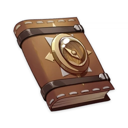

# Lost Adventure Notebook

!!! note
    A set of adventurer's notes that you picked in the ruins. It seems to contain a clue to unlocking these mechanisms.
  
"Eric can't hold on any longer... We had no choice but to give up. I'll leave this notebook here. Maybe this treasure is destined for someone else.  
  
As you may have noticed, the **mechanism installed by the door needs someone operating it constantly**. Otherwise, the other mechanisms cannot be operated.  
But there's a catch...  
The person operating the mechanism by the door takes on an enormous risk.  
If the other mechanisms are operated in the wrong sequence, that person will face...  
  
One other word of advice:  
**The number or torches does not indicate the sequence of operation**... We made that mistake, and paid a painful price.  
Perhaps... **the order has something to do with the position of the torches on the ground**?  
  
What is the answer?  
Oh, how I wish to know...  
But Eric physically can't take any more..."